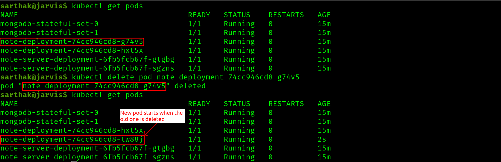

Lab-3
======

Sarthak Kaushik(101471600)
---------------------------

Deploying minikube cluster with 2 nodes
-----------------------------------------

1. 
2. 
3. 
4. 
5. 
6. 
7. 
8. 

Apply the `replica-set` YAML file
----------------------------------

9. 

Delete a pod and see that it recreates with a different name and time stamp
----------------------------------------------------------------------------

10. 

Deployment rollout status
---------------------------

11. 

Apply `replicate_set_deployment` YAML file
------------------------------------------

12. 

Apply `daemon-set` YAML file
-----------------------------

13. 

Apply `resource-limits` YAML file
----------------------------------

14. 
15. 

Apply `health-check` YAML file
--------------------------------

16. 

Deploying a full-stack application
====================================

1. 

1. 

2. 
3. 
4. 
5. 
6. 
7. 

Task: Bring down note-depp pod
-------------------------------

8. 

1. 

1. 

