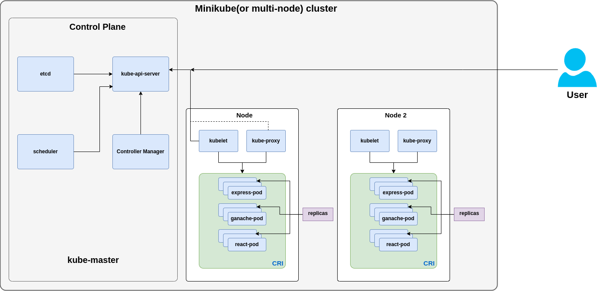
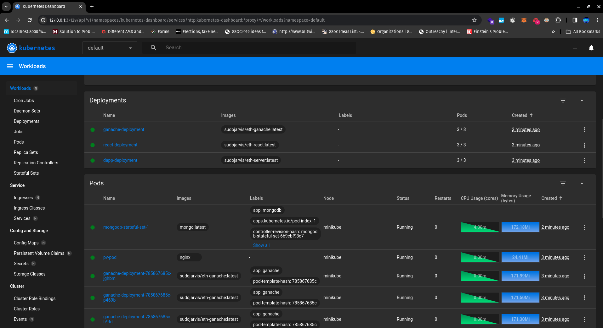
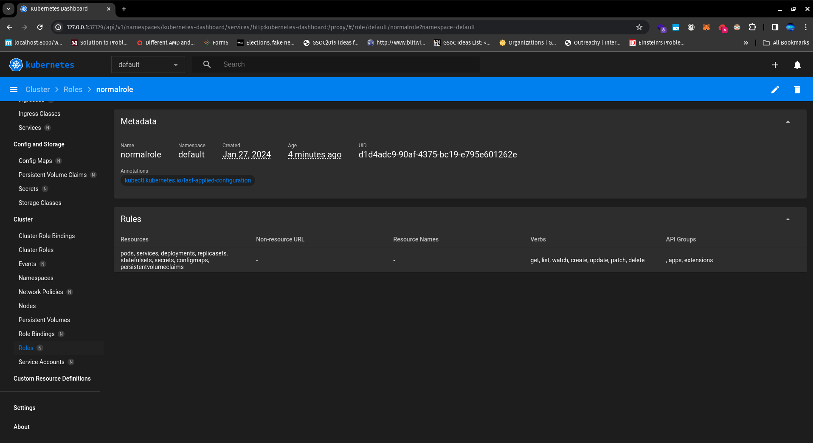
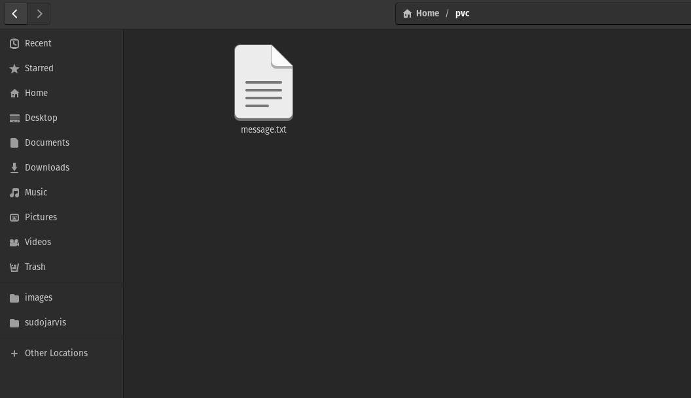

Lab-4
======

Sarthak Kaushik(101471600)
---------------------------

Structure of the `lab-4` dir
----------------------------

- Design rationale document is in the `design-document` dir.
- All screenshots are in the `images` dir.
- All the YAMLs are in the `k8s-yaml-files` dir.

Architecture Diagram
----------------------------

Design Document
----------------------------

[Cick to view the Design Document](./design-document/DesignDocument.pdf)

Starting minikube with 16 cores and 48 GiB RAM
------------------------------------------------

1. 

Dashboard after full deployment
--------------------------------

2. 
3. 
4. 
5. 

Services
----------

6. 

ConfigMaps
----------

7. 

PVCs
------

8. 

Secrets
--------

9. 

Storage Classes
-----------------

10. 

Cluster Role Bindings
-----------------------

11. 

Cluster Roles
--------------

12. 

Namespaces
-----------

13. 

Nodes
-------

14. 

PVs
-----

15. 

Role Bindings
--------------

16. 

Roles
--------

17. 

Service Accounts
------------------

18. 

All services
-------------

18. 

Forwarding pods from K8s to make the services accessible on `localhost` and facilitate inter-service communication
--------------------------------------------------------------------------------------------------------------------

18. 
18. 

ReplicaSet
-------------

The replicas of the pods are shown, the cluster will maintain atleast the 
declared number of copies of these (here 3).

1. 

Storage
---------

Using PVC to write the message to a file:

1. 
2. 
1. 

Scaling
---------

Horizontal pod autoscaling technique is used.

1. 

Load Balancing
---------------

This has been achieved using the `spec` attribute's type of `LoadBalancing`.

1. 

Secrets
---------

1. 

Config Map
------------

1. 

RBAC
-------

1. Client certificate for the user:

2. User entry in kubeconfig:

3. Context entry in kubeconfig:

4. Switched to the created user:

5. Role Creation with read-only access

6. Binding the Role to the user sarthak

Docker Ethereum App UI
----------------------

1. 
1. 
1. 

